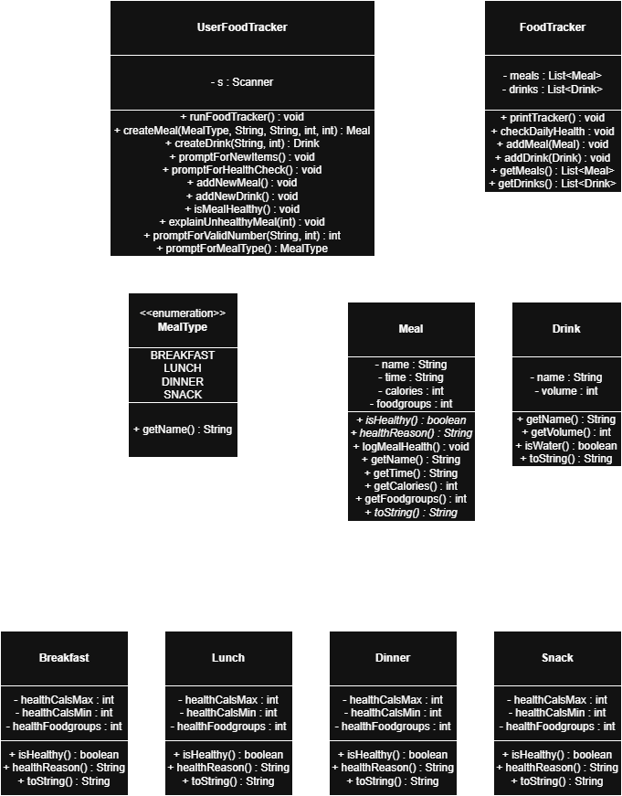

# ICS4U OOP Design Project

See instructions [here](INSTRUCTIONS.md) for details.

  

## Summary
This design models a person's daily meal system. It will handle the type of meal (breakfast, lunch, dinner and snack) and the meal's details (calories, food groups, time of eating). The system will determine if the user's meal is balenced / healthy.
